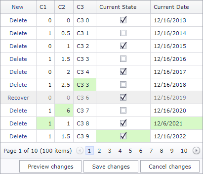

<!-- default badges list -->

[](https://supportcenter.devexpress.com/ticket/details/T114462)
[](https://docs.devexpress.com/GeneralInformation/403183)
<!-- default badges end -->

# GridView for Web Forms - How to implement custom buttons in the status bar in batch edit mode

<!-- run online -->
**[[Run Online]](https://codecentral.devexpress.com/t114462/)**
<!-- run online end -->

In [batch edit mode](https://docs.devexpress.com/AspNet/16443/components/grid-view/concepts/edit-data/batch-edit-mode), the Grid displays three buttons in the [status bar](https://docs.devexpress.com/AspNet/3693/components/grid-view/visual-elements/status-bar): _Preview changes_, _Save changes_, and _Cancel changes_. You cannot change the behavior of the default buttons, but you can replace them with custom buttons. See the example below for details.




To replace the default buttons with custom buttons, implement the [StatusBar](http://docs.devexpress.devx/AspNet/DevExpress.Web.GridViewTemplates.StatusBar) template.

```aspx
<Templates>
  <StatusBar>
    <dx:ASPxButton ClientInstanceName="btnPreview"... />
    <dx:ASPxButton ClientInstanceName="btnSave"... />
    <dx:ASPxButton ClientInstanceName="btnCancel"... />
  </StatusBar>
</Templates>
```

Handle the [BatchEditEndEditing](http://docs.devexpress.devx/AspNet/js-ASPxClientGridView.BatchEditEndEditing) event and change the button visibility based on your conditions. In this example, custom buttons repeat the default buttons' behavior: they are hidden when the Grid has no changes and the _Show changes_ button changes its text when clicked.

```js
function SetButtonsVisibility(s) {
  var visibility = s.batchEditApi.HasChanges()
  btnPreview.SetVisible(visibility);
  btnSave.SetVisible(visibility);
  btnCancel.SetVisible(visibility);
}

function onPreviewChangesClick(s, e) {
  if (isPreviewChangesVisible) {
    s.SetText("Show changes");
    gridView.batchEditApi.HideChangesPreview();
  }
  else {
    s.SetText("Hide preview");
    gridView.batchEditApi.ShowChangesPreview();
  }
  isPreviewChangesVisible = !isPreviewChangesVisible;
}
```

## Files to Look At
- [Default.aspx](./CS/T114462/Default.aspx) (VB: [Default.aspx](./VB/T114462/Default.aspx))

## Documentation
- [Batch Edit Mode](https://docs.devexpress.com/AspNet/16443/components/grid-view/concepts/edit-data/batch-edit-mode)

## More Examples
- [GridView - Batch Editing - How to display save and cancel buttons only after editing](https://github.com/DevExpress-Examples/gridview-batch-editing-how-to-display-save-and-cancel-buttons-only-after-editing-t150411)